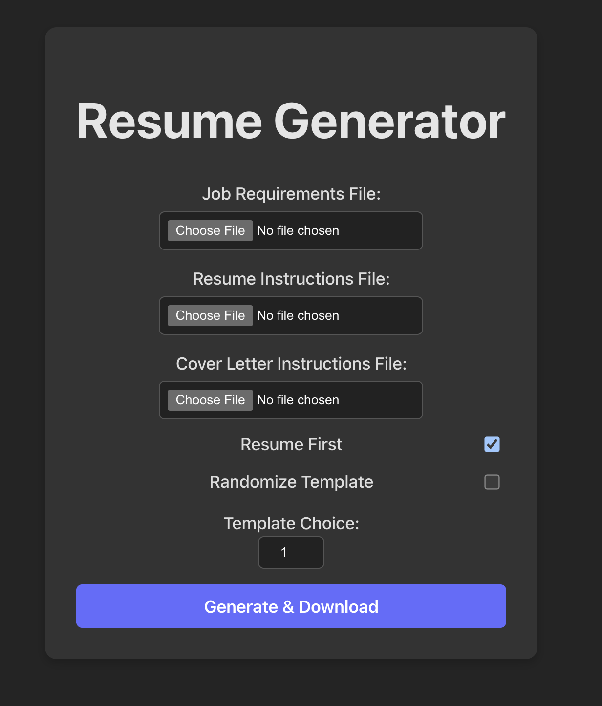
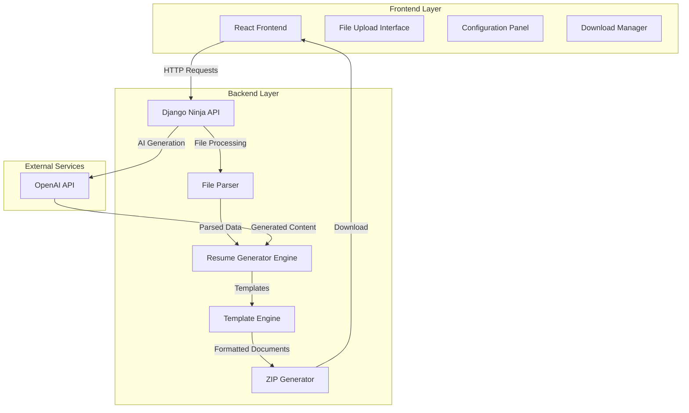
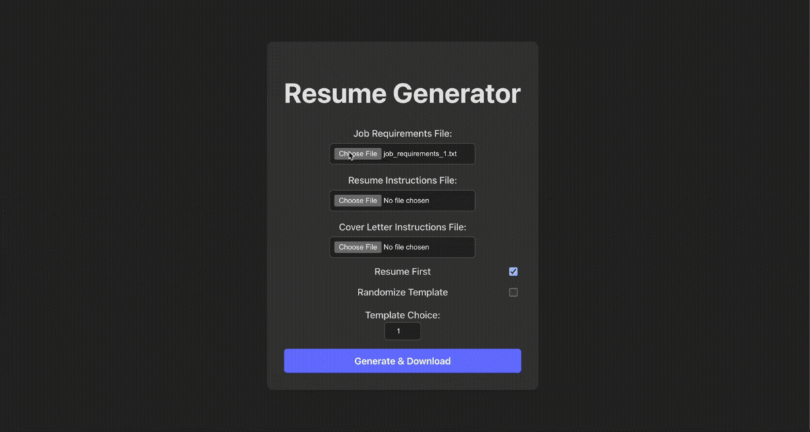

# Resume Generator

<div align="center">



[](https://github.com/your-username/Resume_Generator_API)
[](https://github.com/your-username/Resume_Generator_API)
[](LICENSE)
[](https://djangoproject.com/)
[](https://reactjs.org/)
[](https://python.org/)

*Automated resume and cover letter generation tool developed for University of Michigan Information Technology Services testing workflows*

</div>


## Table of Contents

- [Overview](#overview)
- [Features](#features)
- [Architecture](#architecture)
- [Prerequisites](#prerequisites)
- [Installation](#installation)
- [Configuration](#configuration)
- [Usage](#usage)
- [File Format Requirements](#file-format-requirements)
- [API Documentation](#api-documentation)
- [Frequently Asked Questions](#frequently-asked-questions)
- [Troubleshooting](#troubleshooting)
- [Contributing](#contributing)
- [License](#license)


## Overview

The **Resume Generator** is a full-stack web application designed for the University of Michigan Information Technology Services (ITS) to automate the generation of resumes and cover letters for testing purposes. Built with **Django Ninja** (backend) and **React** (frontend), this tool streamlines the creation of multiple resume variations based on job requirements and customizable templates.


## Why This Tool Exists

- **Automated Testing**: Generate multiple resume variations for ITS testing workflows
- **Efficiency**: Batch process resume and cover letter generation
- **Consistency**: Ensure standardized formatting across all generated documents
- **Flexibility**: Support multiple templates and customizable generation orders


## Features

- **Batch Resume Generation**: Create multiple resumes and cover letters simultaneously 
- **ZIP File Export**: Download all generated documents in a single archive  
- **Multiple Templates**: Choose from various professional resume templates  
- **Customizable Order**: Generate resumes before cover letters or vice versa  
- **Random Generation**: Automatically randomize templates and generation order  
- **Structured Input**: Support for organized text file inputs with clear formatting  
- **OpenAI Integration**: Leverage AI for intelligent content generation  
- **Real-time Processing**: Fast generation with live progress updates  


## Architecture



## Technology Stack

- **Frontend**: React 18+, Vite, Tailwind CSS
- **Backend**: Django 4.2+, Django Ninja REST Framework
- **AI Integration**: OpenAI GPT API
- **File Processing**: Python built-in libraries
- **Deployment**: Docker (optional), Node.js, Python


## Prerequisites

Before setting up the project, ensure you have the following installed:

- **Python 3.10+** (for the Django backend)
- **Node.js v16+** (for the React frontend)
- **npm** (comes with Node.js)
- **Git** (for version control)


## Installation

Clone the repository and install dependencies:
```bash
# Clone the repository
git clone https://github.com/your-username/Resume_Generator_API.git
cd Resume_Generator_API
git checkout resume-generator

# Install backend dependencies
pip install -r requirements.txt

# Navigate to the frontend and install dependencies
cd frontend
npm install
```


## Configuration And Environment Variables Setup

Navigate to the backend directory and create your environment file 

```bash
cd backend
touch .env
```

Add the following environment variables to your .env file: 

```env
# OpenAI Configuration
MODEL=gpt-3.5-turbo
OPENAI_API_BASE=https://api.openai.com/v1
OPENAI_API_KEY=your_openai_api_key_here
OPENAI_ORGANIZATION=your_organization_id_here
API_VERSION=2023-12-01

# Django Configuration (optional)
DEBUG=True
SECRET_KEY=your_secret_key_here
ALLOWED_HOSTS=localhost,127.0.0.1
```

## Usage - Starting the application


*Alt text: Complete workflow demonstration showing file upload, configuration selection, resume generation process, and ZIP file download*


```bash
# Start the frontend development server
cd frontend
npm run dev
```

The application will be available at http://localhost:5173/ (check terminal output for exact port).


## Basic Workflow

1. **Upload Files**: Upload your three required `.txt` files
2. **Configure Settings**: Choose template and generation order preferences
3. **Generate**: Click generate to process your files
4. **Download**: Receive a ZIP file with all generated resumes and cover letters


## File Format Requirements


*Alt text: Example text file showing proper double-newline delimiter formatting between sections*

**CRITICAL: File Formatting Rules**
You must upload exactly three .txt files:

- **Job Requirements** Upload your requirements file
- **Resume Instructions** Upload your resume instructions file
- **Cover Letter Instructions** Upload your cover letter instructions file

**Formatting Structure**
Each file must use double newlines (\n\n) as section delimiters. All three files must have the same number of sections.

**Example Format**

```txt
Section 1 content here
[blank line]
[blank line]
Section 2 content here
[blank line]
[blank line]
Section 3 content here
```

**Sample Job Requirements File**
```txt
Software Engineer position requiring Python, Django, and React experience. Must have 3+ years of web development experience.


Data Analyst role focusing on SQL, Python, and data visualization. Experience with machine learning preferred.


Product Manager position requiring agile methodology experience and cross-functional team leadership skills.
```


## API Documentation 

**Core Endpoints**

```http
POST /api/upload-files/
Content-Type: multipart/form-data

# Upload the three required text files
```

```http
POST /api/generate-resumes/
Content-Type: application/json

{
    "template": "professional",
    "order": "resume_first",
    "randomize": false
}
# Generate the actual Resumes and Cover Letters
```

```http
GET /api/download/{job_id}
# Download generated ZIP file
```


## FAQ

### General Usage 

**Q**: How many resumes can I generate at once?
A: The number of resumes generated equals the number of sections in your input files. If each file has 5 sections, you'll get 5 resumes and 5 cover letters.

**Q**: What file formats are supported for input?
A: Only .txt files are supported. Ensure your files use UTF-8 encoding for best results.

**Q**: Can I preview the resumes before downloading?
A: Currently, the system generates all documents and provides them as a ZIP download. Preview functionality is planned for future releases.

### Technical Issues

**Q**: Why am I getting a "sections mismatch" error?
A: This occurs when your three input files don't have the same number of sections. Ensure all files use the double-newline delimiter consistently.

**Q**: The generation process seems slow. Is this normal?
A: Yes, AI-powered generation can take 30-60 seconds depending on the number of sections and OpenAI API response times.

**Q**: Can I use this tool offline?
A: No, the tool requires an internet connection to access the OpenAI API for content generation.
File Formatting

### File Formatting

**Q**: What's the maximum file size supported?
A: Input files should be under 10MB each. Larger files may cause processing delays or timeouts.

**Q**: Can I include special characters in my input files?
A: Yes, but ensure your files use UTF-8 encoding to prevent character encoding issues.


## Troubleshooting

**Installation Problems**

```bash
# If pip install fails, try upgrading pip first
python -m pip install --upgrade pip
pip install -r requirements.txt

# If npm install fails, clear cache
npm cache clean --force
npm install
```

**Environment Variable Issues**

- Ensure your `.env` file is in the `backend` directory
- Check that your OpenAI API key is valid and has sufficient credits  
- Verify all required environment variables are set

**File Upload Errors**

- Confirm all three files are .txt format
- Check that files use double-newline delimiters
- Ensure all files have the same number of sections

**Getting Help**
If you encounter issues not covered here:

- Check the browser console for error messages
- Review the backend logs in your terminal
- Verify your OpenAI API key and credits
- Ensure all prerequisites are properly installed


## Contributing
This project was developed for University of Michigan ITS testing workflows. For contribution guidelines or feature requests, please contact the ITS development team.


## Development Setup

```bash
# Install development dependencies
pip install -r requirements-dev.txt
cd frontend && npm install --include=dev

# Run tests
python manage.py test
cd frontend && npm test
```


## License

This project is licensed under the MIT License. See LICENSE file for details.


## Acknowledgments 

- **Developed for University of Michigan Information Technology Services**
- **Built with Django Ninja REST framework**
- **AI-powered by OpenAI GPT models**
- **Frontend powered by React and Vite**

<div align="center">

**[⬆ Back to Top](#resume-generator)**

Made with ❤️ for University of Michigan ITS

</div>

